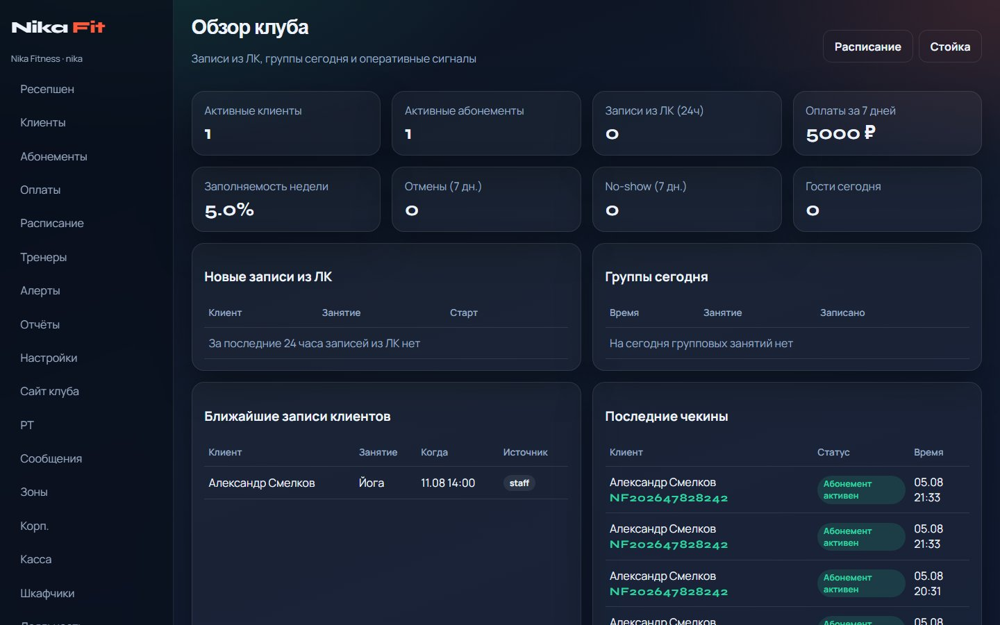
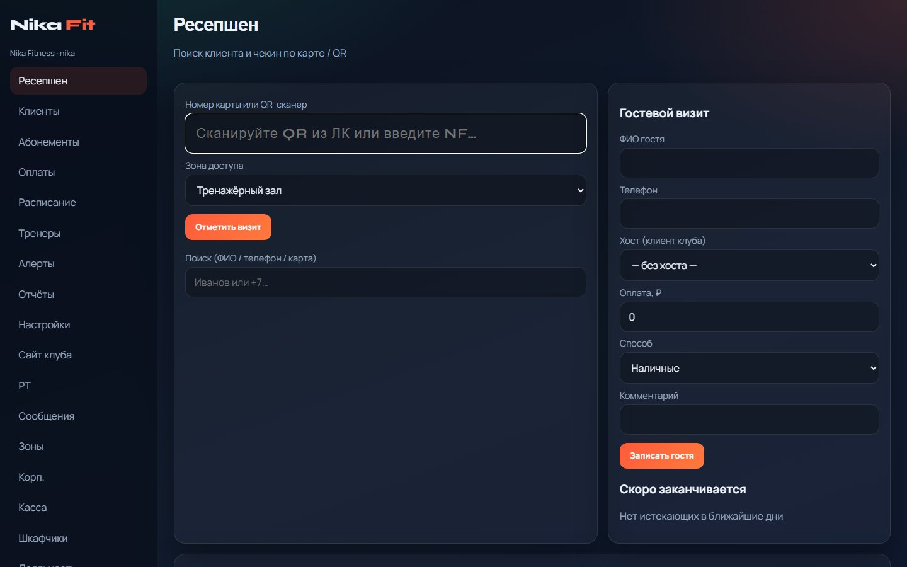
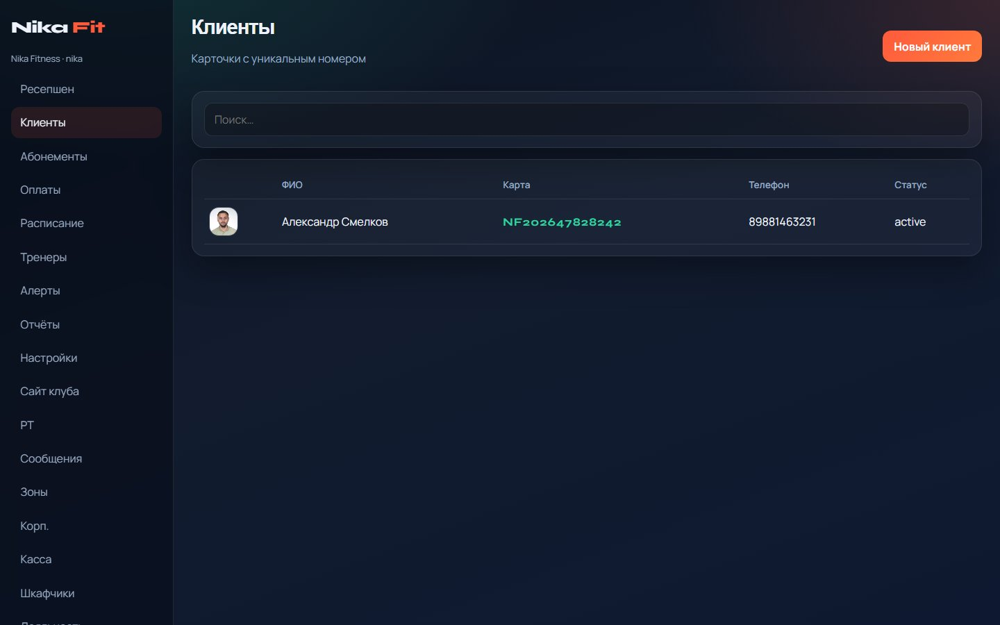
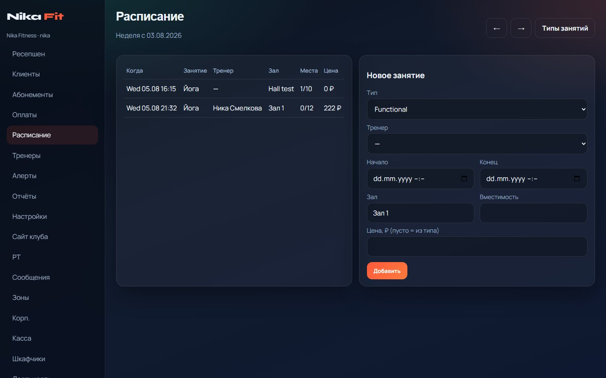
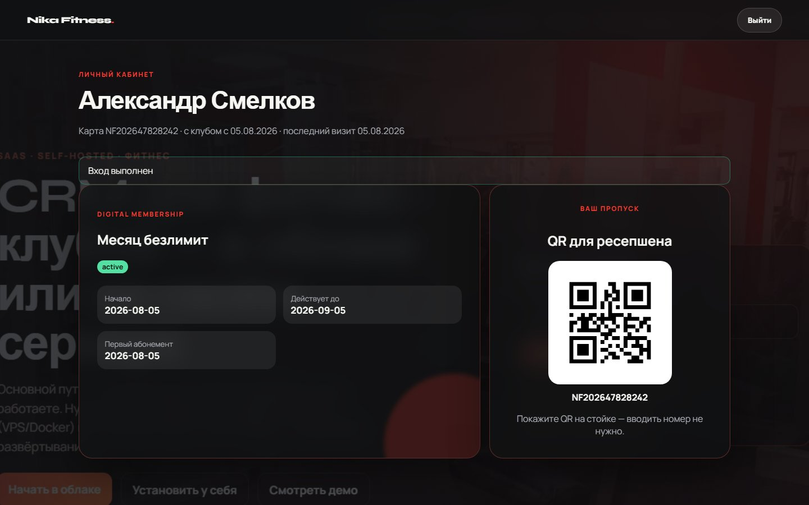
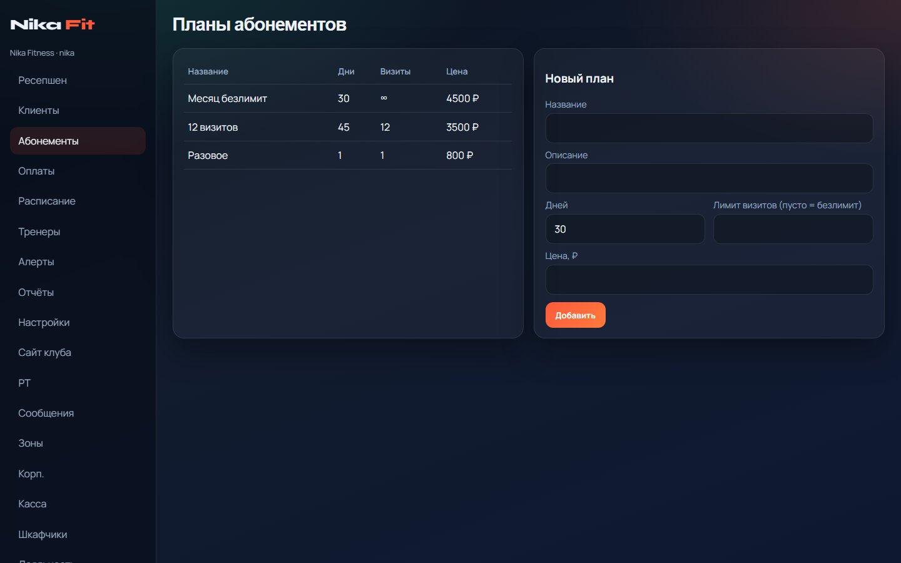
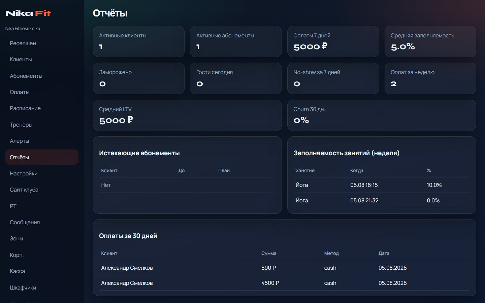
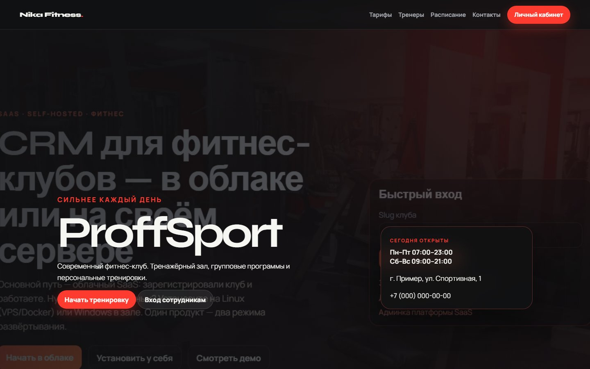
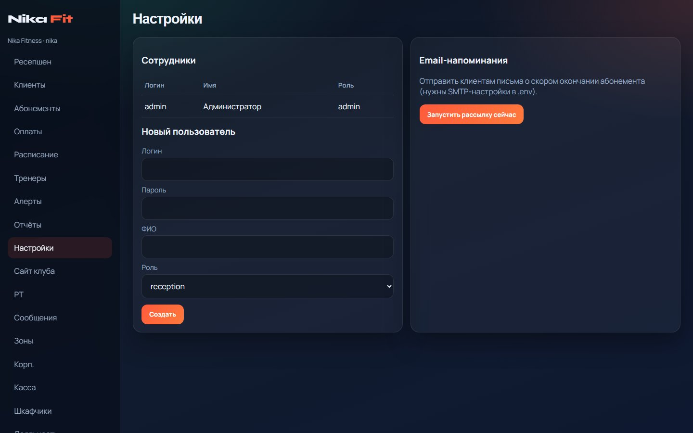

<p align="center">
  <a href="https://github.com/nika-sc/Nika-Fitness-CRM">
    
  </a>
</p>

<h1 align="center">Nika <em>Fit</em></h1>

<p align="center"><strong>CRM для фитнес-клубов на своём сервере</strong></p>

<p align="center">
  Ресепшен · абонементы · расписание · ЛК клиента · сайт клуба<br>
  Linux (Docker / VPS) или Windows в зале — полный контроль данных.
</p>

<p align="center">
  <a href="#features">Возможности</a> ·
  <a href="#screenshots">Скриншоты</a> ·
  <a href="#install">Установка</a> ·
  <a href="#linux">Linux</a> ·
  <a href="#windows">Windows</a> ·
  <a href="#docs">Документация</a>
</p>

<p align="center">
  <a href="#install"></a>
  <a href="docs/DEPLOY.md"></a>
  <a href="LICENSE"></a>
</p>

<p align="center">
  <a href="docs/USER_GUIDE.md">Руководство</a> ·
  <a href="docs/USER_WALKTHROUGH.md">Сценарий дня</a> ·
  <a href="docs/DEPLOY.md">Установка</a> ·
  <a href="SUPPORT.md">Поддержка</a>
</p>

---

## Возможности {#features}

- **Ресепшен** — чекин, гости, алерты, истекающие абонементы
- **Абонементы** — планы, заморозки, оплаты, долги, кассовые смены
- **Расписание** — групповые занятия, запись, waitlist, no-show
- **ЛК клиента** — запись на занятия, визиты, оплаты, QR
- **Сайт клуба** — публичная витрина и редактор в CRM
- **Dashboard** — owner / admin, отчёты и операционный день

---

## Скриншоты {#screenshots}

<p align="center"><strong>Dashboard</strong> · <strong>Ресепшен</strong></p>
<p align="center">
  
  &nbsp;
  
</p>

<p align="center"><strong>Клиенты</strong> · <strong>Расписание</strong></p>
<p align="center">
  
  &nbsp;
  
</p>

<p align="center"><strong>ЛК клиента</strong> · <strong>Абонементы</strong></p>
<p align="center">
  
  &nbsp;
  
</p>

<p align="center"><strong>Отчёты</strong> · <strong>Сайт клуба</strong></p>
<p align="center">
  
  &nbsp;
  
</p>

<p align="center"><strong>Настройки</strong></p>
<p align="center">
  
</p>

---

## Установка {#install}

Нужны **Python 3.12+** и **PostgreSQL 16+** (или Docker Compose на Linux).

```bash
python -m venv .venv
# Windows:
.venv\Scripts\activate
# Linux:
# source .venv/bin/activate
pip install -r requirements.txt
cp .env.example .env          # Windows: copy .env.example .env
# задайте SECRET_KEY и DATABASE_URL
python scripts/run_migrations.py --legacy --seed-admin
python run.py
```

Откройте `http://127.0.0.1:5001/login` · встроенная документация `/docs`.

### Linux (Docker / VPS) {#linux}

```bash
git clone https://github.com/nika-sc/Nika-Fitness-CRM.git
cd Nika-Fitness-CRM
cp .env.example .env
docker compose up --build
```

HTTPS, reverse-proxy и бэкапы — в [docs/DEPLOY.md](docs/DEPLOY.md).

### Windows (сервер в зале) {#windows}

1. Установите Python 3.12+ и PostgreSQL 16+.
2. Скопируйте `.env.example` → `.env`, укажите `DATABASE_URL`.
3. Миграции и запуск как выше.
4. Автозапуск — служба Windows или Планировщик задач.

Подробно: [docs/DEPLOY.md](docs/DEPLOY.md).

---

## Документация {#docs}

| Документ | О чём |
|----------|--------|
| [USER_GUIDE.md](docs/USER_GUIDE.md) | Руководство оператора |
| [USER_WALKTHROUGH.md](docs/USER_WALKTHROUGH.md) | Сценарий рабочего дня |
| [DEPLOY.md](docs/DEPLOY.md) | Linux / Windows |
| [CHANGELOG.md](docs/CHANGELOG.md) | История изменений |

---

## Лицензия и поддержка

- MIT — [`LICENSE`](LICENSE)
- Вопросы и помощь с VPS/Windows — [`SUPPORT.md`](SUPPORT.md)
- Не коммитьте `.env` и персональные uploads

Репозиторий: [`nika-sc/Nika-Fitness-CRM`](https://github.com/nika-sc/Nika-Fitness-CRM)
