# Руководство пользователя Nika Fitness CRM

Полное руководство для владельца клуба, администратора и ресепшена.  
Все пути ниже — для **self-hosted** установки (один клуб на сервере).

**Версия:** 1.5  
**Последнее обновление:** 2026-08-22

Связанные документы:

- [USER_WALKTHROUGH.md](USER_WALKTHROUGH.md) — пошаговый сценарий рабочего дня со скриншотами;
- [DEPLOY.md](DEPLOY.md) — установка Linux / Windows;
- [CHANGELOG.md](CHANGELOG.md) — история обновлений.

---

## Содержание

1. [Вход и роли](#1-вход-и-роли)
2. [Обзор](#2-обзор)
3. [Ресепшен](#3-ресепшен)
4. [Клиенты](#4-клиенты)
5. [Абонементы, оплаты и касса](#5-абонементы-оплаты-и-касса)
6. [Расписание и тренеры](#6-расписание-и-тренеры)
7. [Личный кабинет клиента](#7-личный-кабинет-клиента)
8. [Заявки из ЛК у staff](#8-заявки-из-лк-у-staff)
9. [Алерты](#9-алерты)
10. [Отчёты](#10-отчёты)
11. [Настройки и сайт клуба](#11-настройки-и-сайт-клуба)
12. [Дополнительные модули](#12-дополнительные-модули)
13. [FAQ](#13-faq)
14. [Поддержка](#14-поддержка)

---

## 1. Вход и роли

### 1.1. Адреса

| Раздел | URL |
|--------|-----|
| Вход сотрудников | `/login` |
| Обзор | `/dashboard` |
| Стойка ресепшена | `/reception/` |
| Кабинет тренера | `/trainer/` |
| Личный кабинет клиента | `/portal` |
| Публичный сайт клуба | `/club/` |
| Документация на сервере | `/docs` |

### 1.2. Экран входа

1. Откройте `/login`.
2. Введите логин и пароль сотрудника.
3. Нажмите **Войти**. Чтобы не входить заново в течение смены, оставьте **Запомнить до полуночи** — выход сам в 00:00 по времени клуба. Без галочки сессия держится, пока открыт браузер.

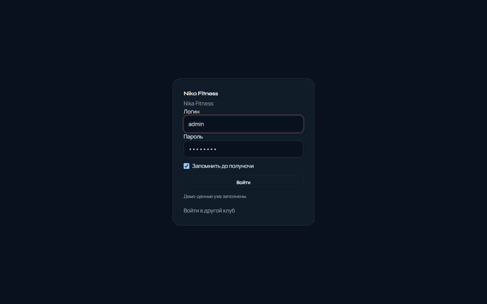

После первого входа **смените** пароль учётной записи администратора из поставки. Не храните его в чатах и не оставляйте на общем компьютере.

CRM сотрудников можно **добавить на домашний экран** телефона (в браузере: «На экран Домой» / «Установить приложение»). Так стойка и обзор открываются как отдельное приложение. Личный кабинет клиента ставится отдельно, со страницы `/portal`.

### 1.3. Роли

В меню роли пишутся по-русски. В скобках — служебное имя, если смотрите настройки сотрудников.

| На экране | Основной сценарий |
|-----------|-------------------|
| Владелец (`owner`) | Полный контроль клуба, обзор, настройки, сотрудники |
| Админ (`admin`) | Операционное управление, отчёты, расписание, клиенты |
| Ресепшен (`reception`) | Стойка, чекин, продажи абонементов, гости |
| Тренер (`trainer`) | Свой кабинет: окна для персоналок, записи клиентов, отметки; просмотр расписания и клиентов |

Владелец и админ после входа попадают в **Обзор** (`/dashboard`). Ресепшен сразу открывает стойку, тренер со связанной карточкой — **Мои тренировки** (`/trainer/`).

---

## 2. Обзор

Раздел **Обзор** в меню (`/dashboard`) — стартовая точка для владельца и админа.

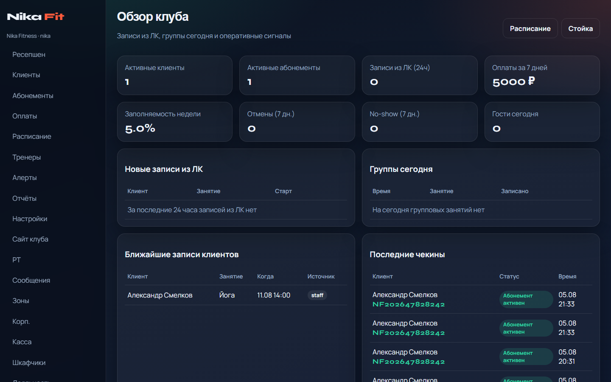

На панели:

- KPI: активные клиенты и абонементы, оплаты за 7 дней, заполняемость;
- записи из ЛК за 24 часа, отмены и no-show;
- блок **«Новые записи из ЛК»**;
- блок **«Группы сегодня»**;
- ближайшие записи и последние чекины.

Быстрые кнопки сверху ведут в расписание и на стойку ресепшена.

---

## 3. Ресепшен

Стойка: `/reception/`.

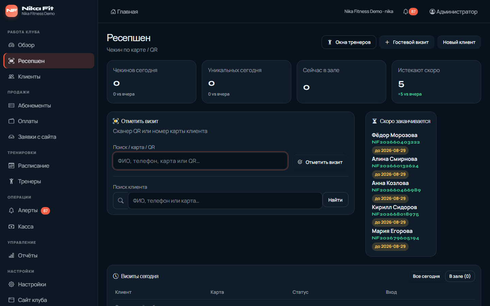

### 3.1. Поиск и чекин

1. В поле поиска на стойке начните вводить **ФИО, телефон или номер карты**. Подсказки появляются после трёх символов; полный номер карты можно ввести и короче.
2. Либо отсканируйте QR из личного кабинета клиента.
3. При необходимости выберите **зону доступа** (если модуль зон включён).
4. Нажмите **Отметить визит**.

После отметки открывается **карточка клиента с крупным фото** — сверьте человека у входа. Кнопка **На стойку** возвращает к очереди.

Система показывает статус абонемента по-русски (**Активен**, **Истекает**, **Заморозка**, **Истёк**) и предупреждения (окончание срока, медсправка и т.п.).

### 3.2. Статистика смены

Карточки KPI на стойке (чекины, уникальные клиенты, истекающие абонементы) ведут в **Статистику**. Там можно выбрать период: сегодня, вчера, позавчера, неделя, месяц, квартал, год или свои даты. Рядом с цифрой — насколько период лучше или хуже предыдущего такого же отрезка. На самой стойке у показателей дня видно сравнение со вчера.

Карточка **Сейчас в зале** открывает таблицу визитов с фильтром «В зале».

### 3.3. Визиты сегодня и выход

Под чекином — таблица **Визиты сегодня**. Фильтры: **Все сегодня** и **В зале**. У тех, кто ещё в зале, в строке есть кнопка **Выход**. Список не раздувает страницу: при большом потоке таблица прокручивается внутри блока.

Справа — виджет **«Скоро заканчивается»** по абонементам. Новый клиент со стойки: ФИО, телефон, план и оплата; номер карты выдаётся автоматически.

### 3.4. Гостевой визит

Гостевой визит записывают на **стойке** (`/reception/`), кнопка рядом с «Новый клиент»:

1. Нажмите **Гостевой визит**.
2. Укажите ФИО и телефон гостя.
3. При желании привяжите **хоста** (клиента клуба).
4. Введите сумму, способ оплаты (наличные / карта / QR) и комментарий.
5. Нажмите **Записать гостя**. Оплата попадает в журнал кассы.

---

## 4. Клиенты

### 4.1. Список

Раздел **Клиенты** (`/members/`).

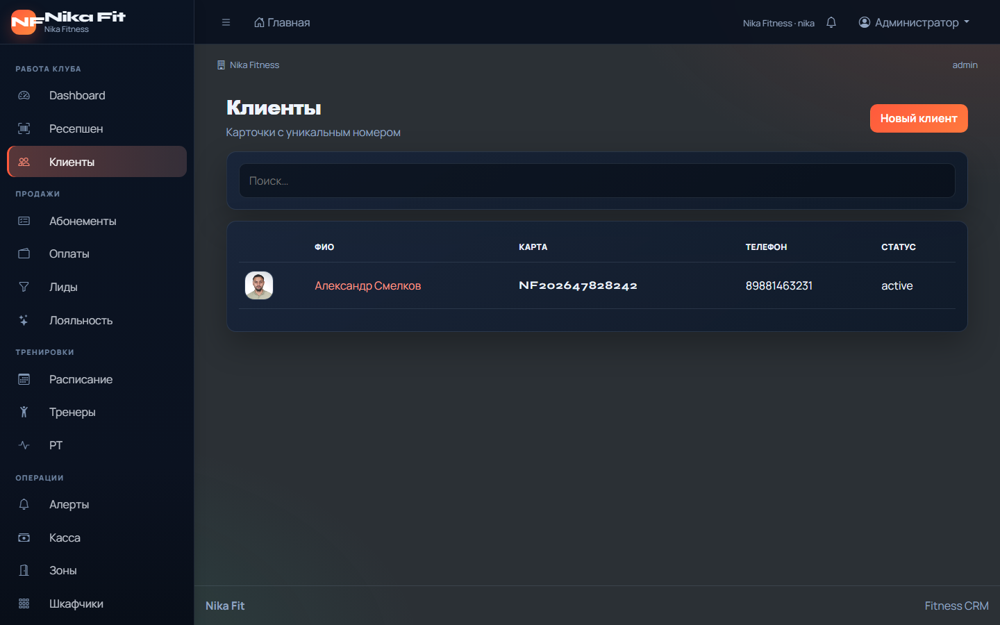

- поиск и фильтры;
- переход в карточку по клику на клиента;
- создание нового клиента (кнопка / форма «новый»).

### 4.2. Карточка клиента

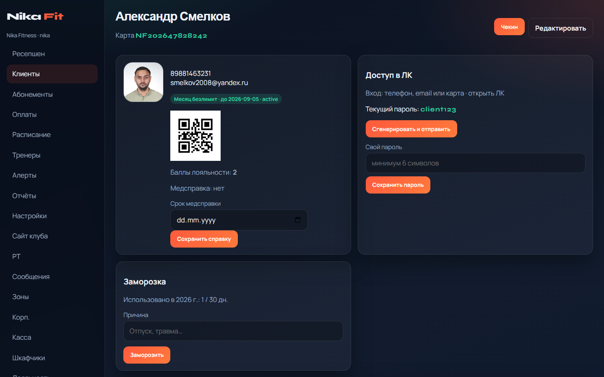

В карточке сверху — **Чекин** и **Изменить**. В одном листе: фото, номер карты, QR, медсправка, абонементы, оплаты и визиты. Снизу в ряд — заморозка, оформление абонемента и доступ: **Открыть ЛК**, **Оценка NPS** (ссылку можно скопировать и отправить клиенту).

- личные данные и контакты;
- текущий и прошлые абонементы, оплаты;
- история визитов;
- доступ в ЛК (логин / выдача пароля);
- QR и **номер карты** для стойки;
- медсправка и связанные модули (PT и др.).

**Номер карты.** Новым клиентам система выдаёт короткий цифровой номер, начиная с **1000**. Короткие «красивые» номера (111, 123, 222, 5555, 7777 и подобные) зарезервированы: их можно выбрать вручную в форме клиента или в окне «новый клиент» на стойке. Старые номера вида `NF…` не меняются.

### 4.3. Выдать доступ в ЛК

1. Откройте карточку клиента.
2. Задайте или сбросьте пароль портала. **Пароль показывается один раз** — сразу передайте его клиенту и не сохраняйте в переписке.
3. Сообщите логин (телефон / email / карта) и этот временный пароль.
4. Клиент входит на `/portal` и при необходимости меняет пароль у себя.

**Оценка NPS** — отдельная страница для клиента: шкала 0–10 и комментарий. В карточке нажмите **Оценка NPS** или скопируйте ссылку и отправьте клиенту. Это не личный кабинет.

---

## 5. Абонементы, оплаты и касса

### 5.1. Планы абонементов

Раздел **Абонементы** → планы (`/memberships/plans`).

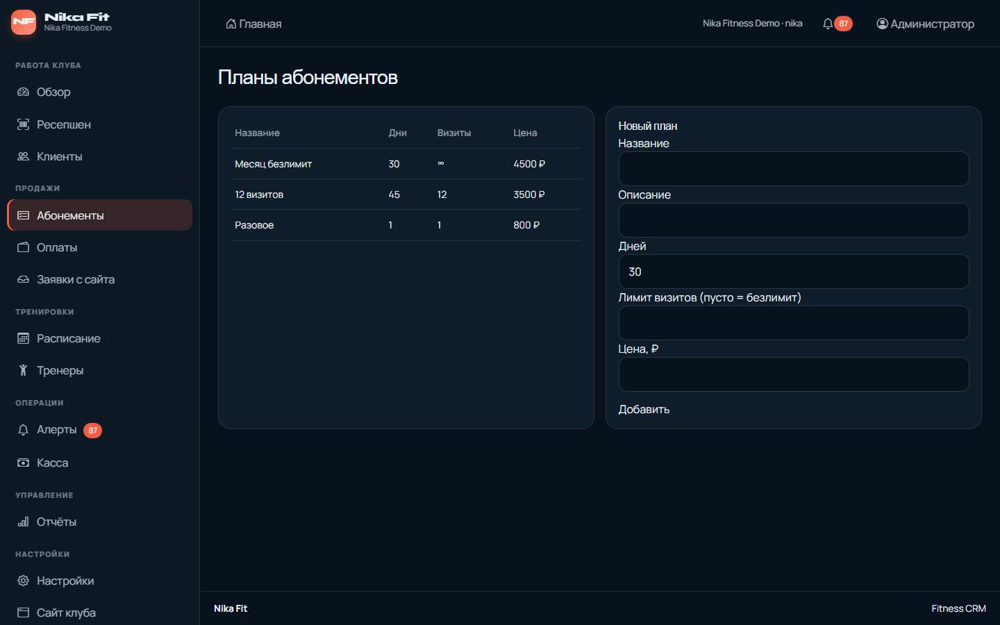

Создавайте и редактируйте планы: срок, лимит визитов, цена, название.

### 5.2. Продажа абонемента

1. Откройте карточку клиента.
2. Выберите план и оформите продажу.
3. Проведите оплату.
4. Убедитесь, что статус абонемента **Активен**.

Другие статусы на экране: **Истекает**, **Заморозка**, **Истёк**. Заморозка и разморозка — из карточки или раздела абонементов.

### 5.3. Журнал оплат

Раздел **Оплаты** (`/memberships/payments`).

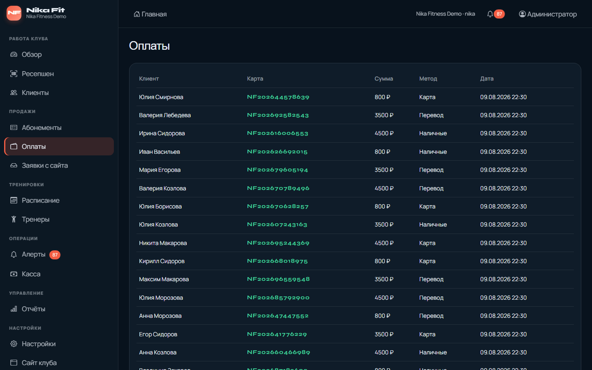

Видны сумма, способ (наличные / карта / QR), дата и комментарий. Та же история доступна в карточке клиента.

### 5.4. Касса

Раздел **Касса** (`/cash/`).

1. Выберите период чипами (сегодня / вчера / позавчера / неделя / месяц / квартал / год) или свои даты.
2. **+ Приход** и **− Расход** открывают модалки: статья, способ (наличные / карта / QR), сумма, комментарий; у прихода клиент необязателен.
3. Ниже — журнал операций за выбранный период и KPI: приход, расход, итог, нал / карта / QR.
4. Оплаты абонементов, гостей и персональных тренировок попадают в журнал сами. Открывать и закрывать смену на этом экране не нужно.

На отчётах виден итог кассы за сегодня.

---

## 6. Расписание и тренеры

### 6.1. Недельное расписание

Раздел **Расписание** (`/schedule/`).

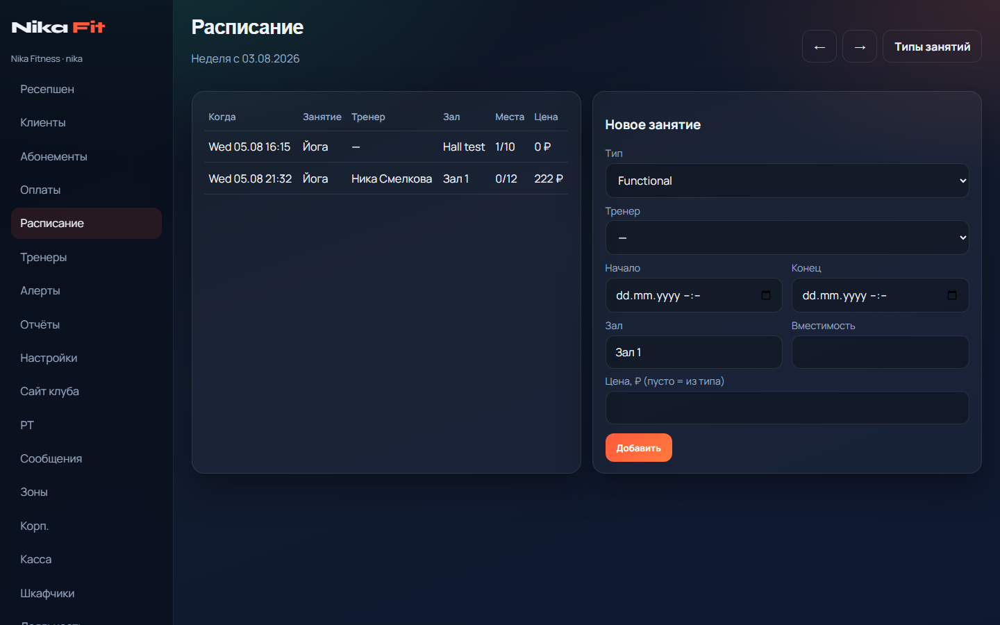

Возможности:

- типы занятий;
- сетка на неделю и кнопка **Сегодня**;
- запись клиентов со стойки;
- статусы брони на экране: **Записан**, **Был**, **Неявка**, **Отмена**;
- лист ожидания и автопродвижение.

### 6.2. Карточка занятия

Откройте конкретную сессию из расписания.

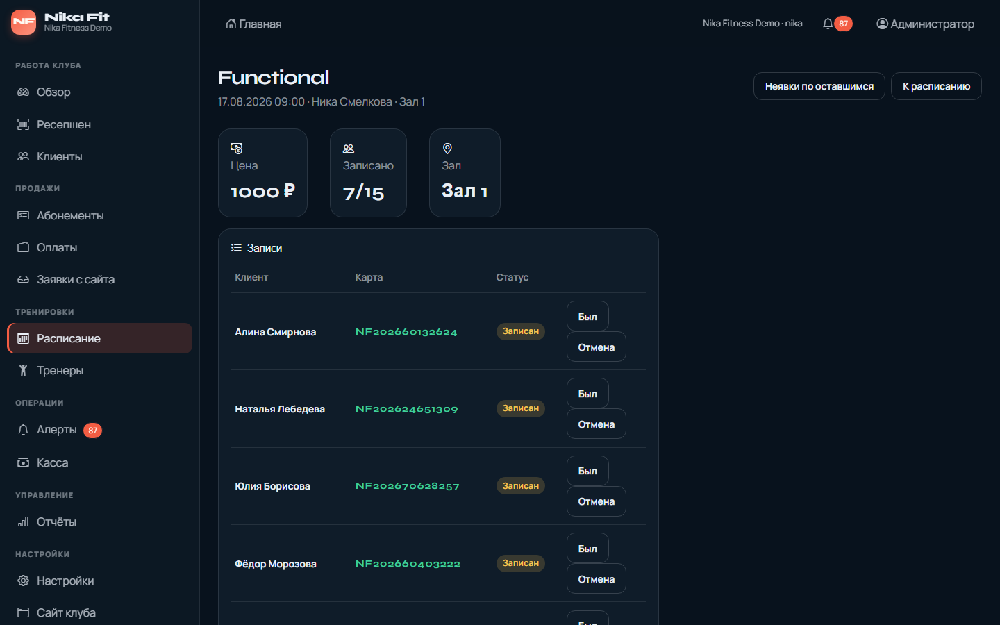

Здесь список записанных, отметки посещения и неявки, источник брони: **ЛК**, **Стойка** или лист ожидания.

### 6.3. Тренеры

Раздел **Тренеры** (`/trainers/`).

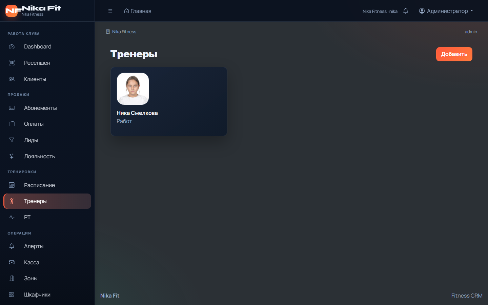

Карточки тренеров привязываются к занятиям в расписании.

### 6.4. Кабинет тренера

Тренер со своим логином открывает раздел **Мои тренировки** (`/trainer/`) и сам ведёт окна для персональных занятий. Оплата в записи не участвует: деньги принимает ресепшен или тренер договаривается с клиентом напрямую.

**Как связать логин с карточкой тренера** (делает владелец или админ):

1. Создайте сотрудника с ролью **Тренер**.
2. Откройте **Тренеры** → нужная карточка → **Изменить**.
3. В поле **Учётная запись** выберите этого сотрудника и сохраните.

Пока связи нет, тренер видит в кабинете подсказку и не может открывать окна. Одна учётная запись привязывается только к одной карточке.

**Что делает тренер в кабинете:**

- **Открыть окна** — дата, время, длительность и место. Чтобы задать сетку, отметьте дни недели и дату «Повторять до»: окна создадутся на весь период. Время в прошлом и пересечения с уже созданными окнами пропускаются.
- **Заявки из личного кабинета** — клиент из ЛК сначала отправляет заявку. Пока тренер не нажмёт **Подтвердить**, запись не считается финальной. **Отклонить** освобождает окно.
- **Моя неделя** — сетка своих окон: **Свободно**, **Ждёт подтверждения**, **Подтверждено**, **Проведено**, **Не пришёл**.
- **Пришёл** / **Не пришёл** — только после подтверждения; **Отменить запись** освобождает окно, **Снять окно** убирает свободное.
- **Подтверждённые записи** — список с клиентом, телефоном и ссылкой на карточку.

Тренер работает только со своими окнами: чужие ему недоступны. Запись со стойки подтверждать не нужно — она сразу **Подтверждено**.

### 6.5. Запись клиента на персоналку со стойки

Два пути:

- **Карточка клиента** → блок **Записать к тренеру**: выберите свободное окно и нажмите **Записать**. Там же видно текущие записи клиента и кнопку отмены.
- **Ресепшен** → кнопка **Окна тренеров** (`/reception/trainer-slots`): свободные окна на сегодня и завтра, клиент выбирается из списка.

Если окно успели занять из ЛК, система об этом скажет и записи не будет — двойной брони не возникает.

У клиента одновременно может быть не больше **трёх** незакрытых записей к тренеру (заявки + подтверждённые). Лимит меняется настройкой `pt_max_active_bookings`.

Раздел можно выключить целиком: **Настройки** → модуль **Слоты тренера**.

---

## 7. Личный кабинет клиента

### 7.1. Вход

URL: `/portal`.  
Клиент входит по телефону / email / номеру карты + паролю (пароль выдаёт staff).

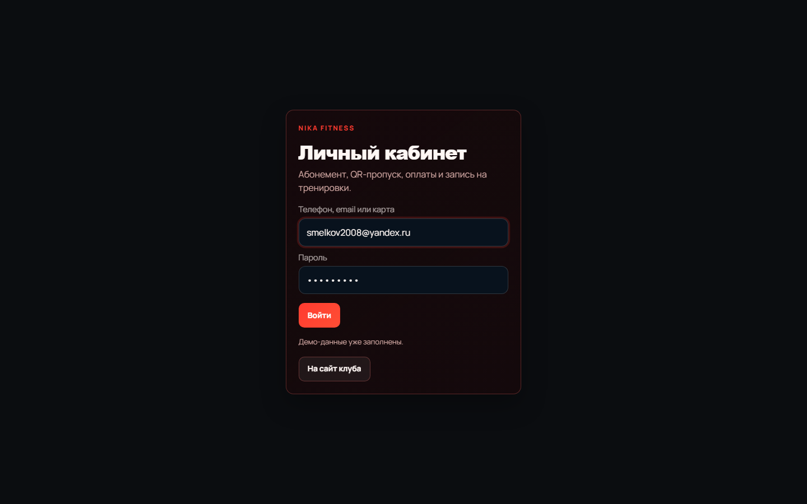

### 7.2. Главный экран ЛК

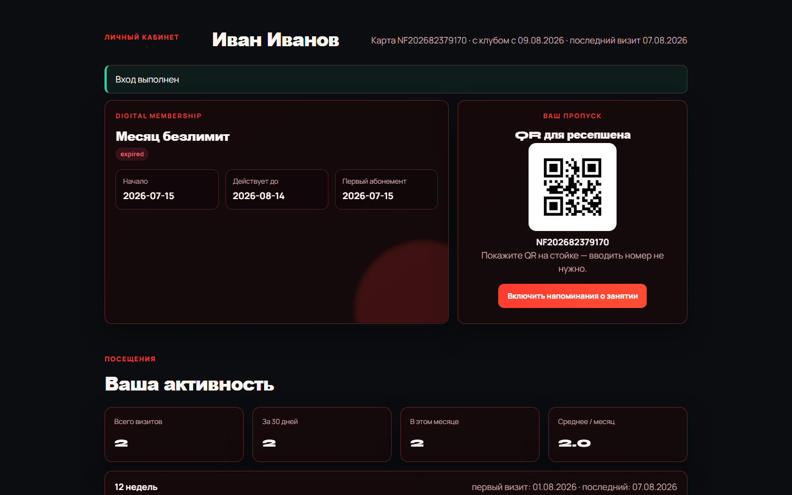

Клиент видит:

- digital membership card и статус абонемента;
- **QR-пропуск** для стойки;
- KPI посещений и 12-недельную активность;
- блок оплат и долга;
- лояльность, медсправку, PT-пакеты (если включены).

### 7.3. Запись на занятие

Прокрутите до каталога **«Доступные занятия»**.

1. Выберите занятие.
2. Нажмите **Записаться**.
3. Система проверяет абонемент и свободные места.
4. Занятие появляется в **«Мои записи»**.

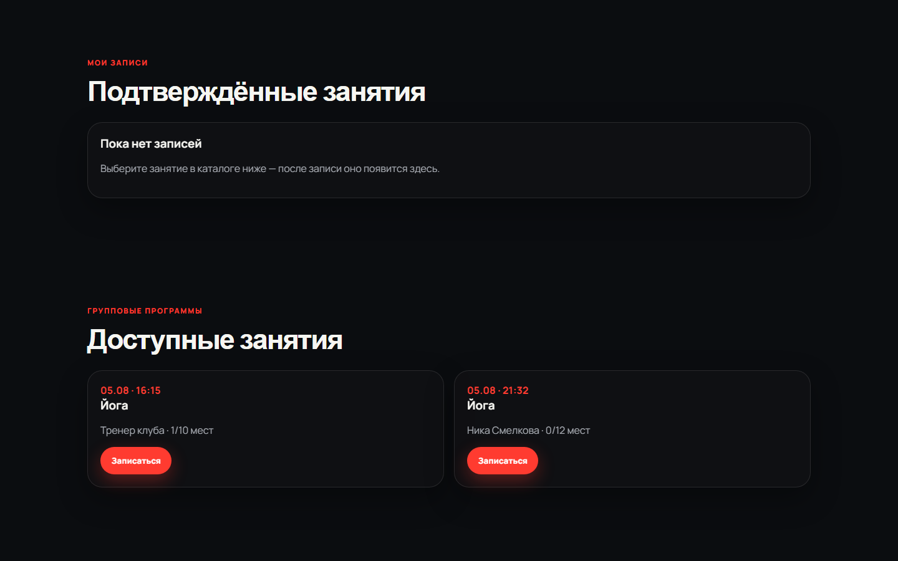

### 7.4. Запись на персональную тренировку

Блок **«Персональные тренировки»** показывает свободные окна тренеров на две недели вперёд и ваши заявки.

1. Выберите окно нужного тренера.
2. Нажмите **Записаться** — активный абонемент для этого не требуется.
3. Появится статус **Ждём подтверждения тренера**. Окно закреплено за вами, но тренировка ещё не подтверждена.
4. Когда тренер нажмёт **Подтвердить**, статус сменится на **Тренер подтвердил**. Если отклонит — окно снова станет свободным.

Одновременно можно держать не больше трёх незакрытых записей (заявки + подтверждённые). Оплата персоналки идёт отдельно: на ресепшене или напрямую с тренером.

### 7.5. Отмена записи

- отмена только **своей** записи;
- не позднее чем за **2 часа** до старта (срок можно изменить в настройках клуба);
- повторная запись на тот же слот не создаёт дубль;
- заявку на персоналку (пока тренер не подтвердил) можно отменить сразу;
- подтверждённую персоналку — не позднее чем за те же **2 часа**, после отмены окно снова свободно.

---

## 8. Заявки из ЛК у staff

После записи клиента из портала:

1. В ленте алертов появляется уведомление о записи из ЛК (групповое занятие) или **заявка на персоналку**.
2. Владелец и админ видят групповые записи в **Обзоре** в блоке **«Новые записи из ЛК»**.
3. Тренер подтверждает персоналку в **Мои тренировки** — до этого клиент видит статус «Ждём подтверждения».

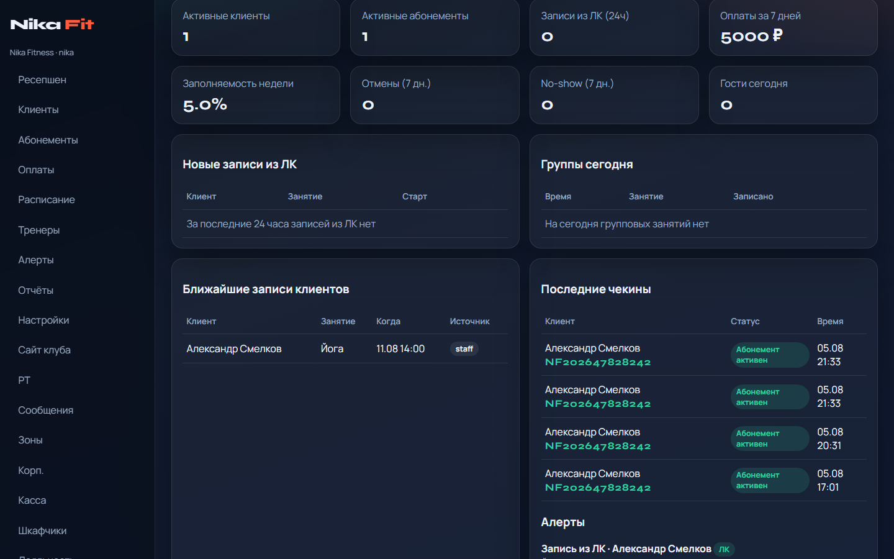

В карточке группового занятия источник брони подписан: **ЛК**, **Стойка** или лист ожидания.

---

## 9. Алерты

Раздел **Алерты** (`/alerts/`).

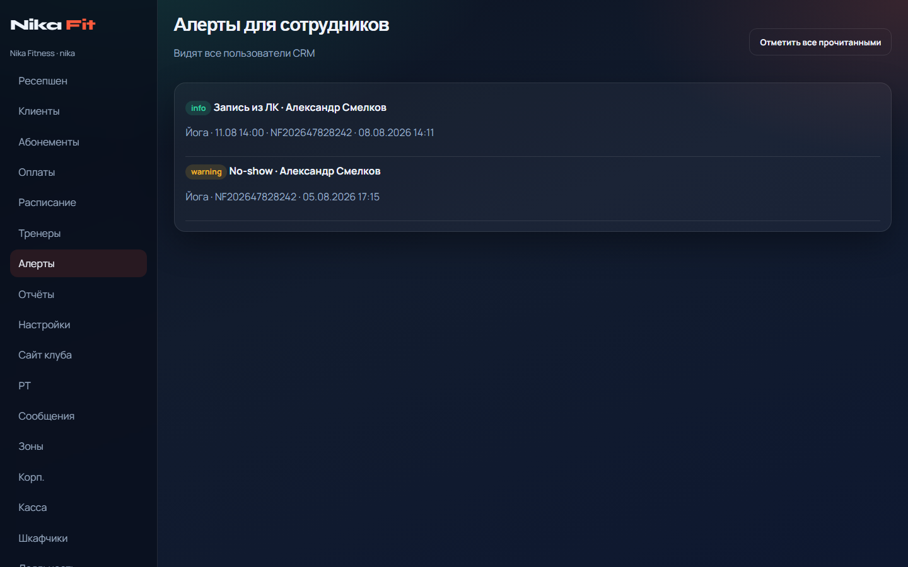

Типовые события:

- запись из клиентского ЛК;
- заявка на персоналку (ждёт тренера), подтверждение и отклонение;
- no-show;
- события по абонементу (истечение и др.).

Рекомендуется просматривать ленту в течение смены и отмечать прочитанные.

---

## 10. Отчёты

Раздел **Отчёты** (`/reports/`).

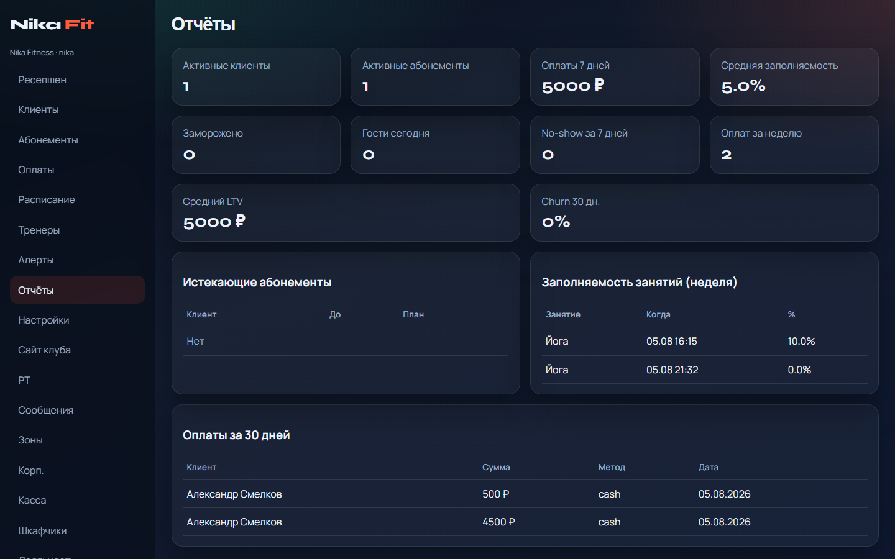

Сводка KPI клуба (активные клиенты/абонементы, оплаты, заполняемость, гости, churn и др.), списки истекающих абонементов и заполняемости занятий.

---

## 11. Настройки и сайт клуба

### 11.1. Настройки

Раздел **Настройки** (`/settings/`) — блоки: клуб, сотрудники, напоминания, модули. Доступен ролям с правом менять настройки.

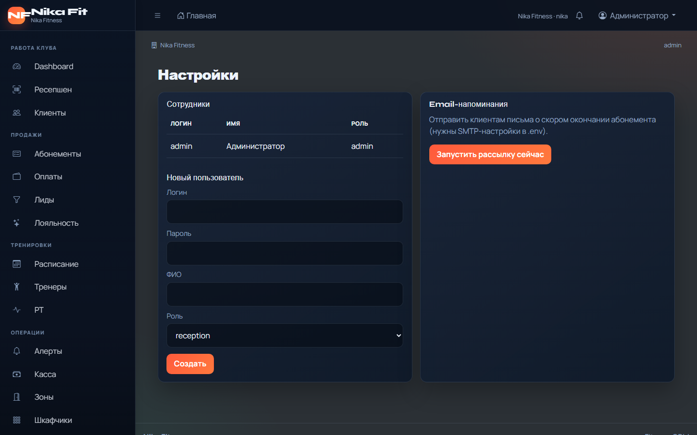

### 11.2. Редактор сайта клуба

Раздел **Сайт клуба** в CRM.

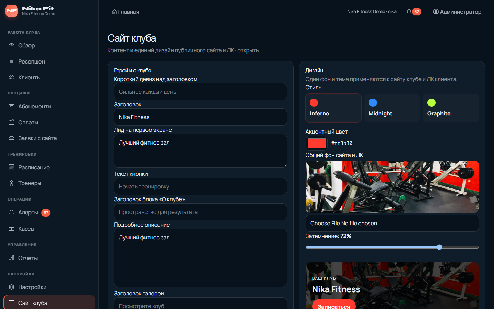

Публичная витрина доступна по `/club/`:

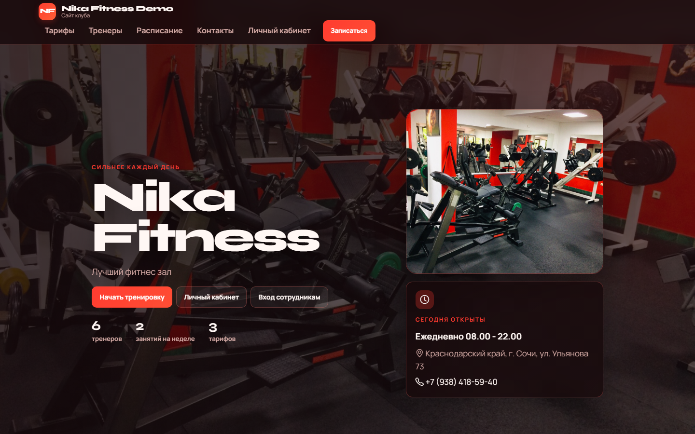

Контент, тема, галерея, карта и контакты редактируются из CRM.

В редакторе отдельно задаются:

- девиз, заголовок и короткий лид на первом экране;
- подробное описание блока «О клубе»;
- текст кнопки, заголовок галереи и фраза в подвале;
- до шести карточек зон и удобств (иконка, название, описание);
- hero-фото (крупный кадр на витрине) и общий фон сайта/ЛК.

В галерее можно загрузить до 24 фото, подписать каждое и менять порядок стрелками. Публичная витрина показывает галерею с увеличением по клику.

### 11.3. Запись с сайта без личного кабинета

Гость сайта может записаться, не заводя логин и пароль в ЛК. Кнопка «Записаться» стоит:

- в шапке и на первом экране — заявка на пробное занятие;
- у каждого занятия в блоке «Ближайшие 7 дней» — заявка на групповую тренировку (если мест нет, кнопка предлагает лист ожидания);
- в карточке тренера — заявка на персоналку; если у тренера открыты свободные окна, гость сразу выбирает удобное время.

В форме только имя, телефон и необязательный комментарий. **Место не занимается автоматически**: заявка ждёт подтверждения администратора.

Включение и текст блока — в редакторе сайта, раздел «Запись с сайта»:

- галочка «Принимать заявки с сайта» (если снять, кнопки и форма пропадают);
- текст в блоке записи — короткое приглашение вместо стандартного.

### 11.4. Раздел «Заявки с сайта»

Заявки приходят в меню **Продажи → Заявки с сайта** (право `manage_site_requests`: владелец, админ, ресепшен). Рядом с пунктом меню — счётчик новых, плюс алерт в колокольчике.

По каждой заявке видно, что именно выбрал гость (занятие с датой, тренер и время или пробная тренировка), его имя, телефон, комментарий и время обращения. Если телефон совпал с существующим клиентом, карточка подтягивается сама.

Что делает администратор:

1. **Привязать** существующего клиента или **Создать карточку** по имени и телефону.
2. **Записать и подтвердить** — только в этот момент появляется реальная запись на занятие или бронь окна тренера. Если группа уже заполнена, кнопка называется **В лист ожидания**: клиент встаёт в очередь и получит место автоматически, когда кто-то отменится.
3. **Связались**, **Отказ** или **Спам** — если запись не состоится.

Внутренний комментарий сохраняется в заявке и виден только сотрудникам. Если окно тренера успели занять со стойки, заявка это покажет — предложите гостю другое время.

Защита от спама работает без капчи: ограничение по IP, не больше пяти заявок с одного телефона в сутки, повторная отправка той же заявки за 15 минут не создаёт дубль.

---

## 12. Опциональные модули

Стартовый пакет всегда включён: ресепшен, клиенты, абонементы, касса, расписание, тренеры, алерты, отчёты, обзор, ЛК, сайт клуба, настройки.

Остальное **выключено по умолчанию** (кроме слотов тренера). Владелец включает в **Настройки → Модули клуба**. Пункт появляется в меню только если модуль включён и у роли есть право.

| Ключ | Модуль | Назначение |
|------|--------|------------|
| `module_trainer_slots` | Слоты тренера | Кабинет тренера и запись на персоналку (**включён по умолчанию**) |
| `module_leads` | Лиды | Воронка до клиента |
| `module_loyalty` | Лояльность | Баллы / NPS |
| `module_pt` | PT | Персональные тренировки с тренером |
| `module_spa` | SPA/бар | Бар и доп. услуги |
| `module_lockers` | Шкафчики | Аренда шкафчиков |
| `module_corporate` | Корпоратив | B2B-контракты |
| `module_payments_online` | Онлайн-оплаты | Эквайринг (заглушка) |
| `module_zones` | Зоны | Зоны доступа при чекине |
| `module_messaging` | Сообщения | SMS / Telegram outbox |
| `module_branches` | Филиалы | Несколько точек |

Роль **Ресепшен** в поставке не получает права на эти модули — только стойка, клиенты, чекин и расписание.

---

## 13. FAQ

### «Не открывается вход / 404 на `/login`»

Проверьте, что приложение запущено, `APP_PORT` верный, и в production настроен reverse-proxy. Для self-hosted пути **без** префикса клуба.

### «Клиент не может войти в ЛК»

Проверьте:

- аккаунт активен;
- выдан ли пароль портала в карточке;
- корректность логина (телефон / email / карта).

### «Не могу отменить запись»

Возможные причины:

- запись не ваша;
- меньше 2 часов до занятия;
- запись уже не в статусе **Записан**.

### «Почему ресепшен не видит Обзор?»

Это ожидаемо: роль **Ресепшен** работает через стойку `/reception/`.

### «Что сделать после обновления программы?»

Обновите код и **примените миграции**, как в [DEPLOY.md](DEPLOY.md). Сценарии стойки и кассы те же; новые поля (статьи кассы, короткие номера карт) появятся сами. Смените пароли учётных записей из поставки, если ещё не меняли.

### «Где документация и новости на сервере?»

- `/docs` — раздел документации  
- `/blog` — новости и релиз-ноты  

Markdown-источники: `docs/blog/*.md`, `docs/CHANGELOG.md`.

---

## 14. Поддержка

- Помощь по установке (локально / VPS / домен / SSL) — по запросу: `info@nika-sc.ru`.
- Индивидуальные доработки и внедрение — платные услуги по согласованию.

См. также [SUPPORT.md](../SUPPORT.md) и [OPEN_SOURCE_CHECKLIST.md](OPEN_SOURCE_CHECKLIST.md).

Пошаговый день с теми же экранами: [USER_WALKTHROUGH.md](USER_WALKTHROUGH.md).
